# kindleVocabularyBuilderExporter
kindleVocabularyBuilderExporter 读取 kindle 中 Vocabulary Builder 的内容，利用 有道翻译API 进行翻译，并对单词进行格式化的导出，方便上传到 Quizlet 进行复习。

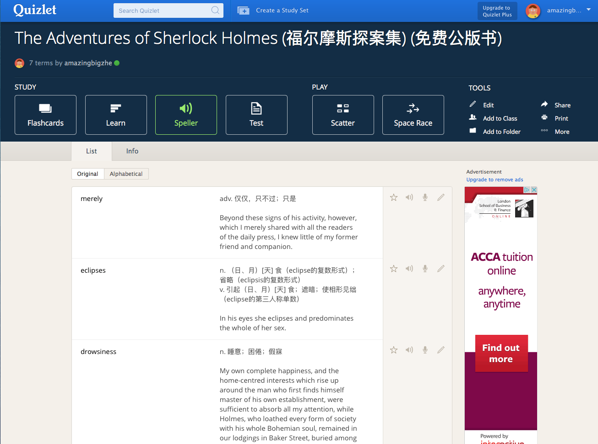

## 基本功能

- 读取 kindle 数据文件
- 根据书名现实单词
- 利用 有道翻译API 对单词进行翻译
- 单词根据格式导出，方便导入 Quizlet 进行复习

## 安装说明
Note: 如果不需要翻译功能可以直接跳到使用说明

第一次使用之前需要进行一些配置以及安装，第二次使用不需要再进行配置

1. 有道翻译API 的申请
2. 填写 有道翻译API 到程序
3. Chrome extension 的安装

#### 有道翻译API 的申请
有道翻译API 是有道公司提供的翻译和查词的数据接口，kindleVocabularyBuilderExporter 使用 有道翻译API
进行翻译。

首先打开 [有道翻译API](https://github.com/Melo618/Simple-Markdown-Guide) 的网址

http://fanyi.youdao.com/openapi?path=data-mode

填写网站名称，网站地址，网站说明以及联系方式。

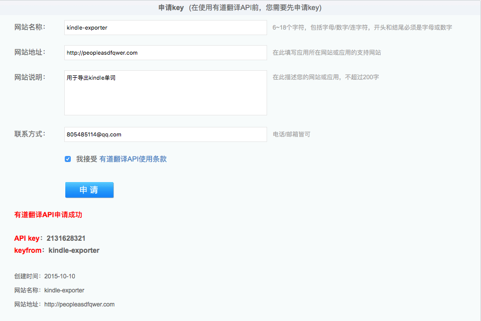

申请成功之后，请保存 __API Key__ 和 __keyfrom__

#### 填写 有道翻译API 到程序

使用文本编辑工具打开 index.html，Windows 可以使用 记事本，Mac 可以下载免费的 Sublime 等

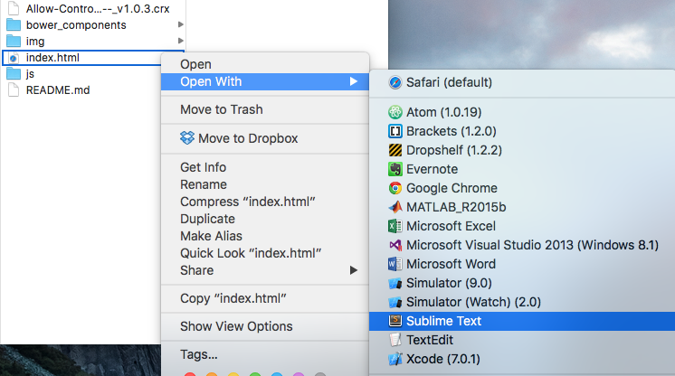

打开后找到大约127行

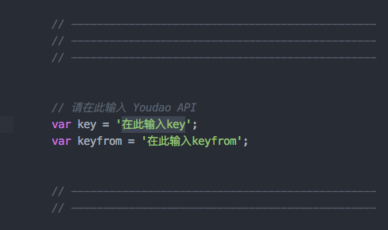

把 __API Key__ 和 __keyfrom__ 输入进去，并保存文件

#### Chrome extension 的安装

由本地浏览器访问有道网页并拿到翻译时候，chrome浏览器默认这是一个不安全的行为，会阻止翻译传进来，所以要安装一个chrome插件防止翻译被阻止

打开Chrome的插件页：把 URL `chrome://extensions` 复制到地址栏 或是点击 Menu > Settings > Extensions 都可以。

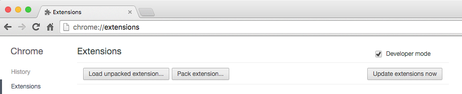

将 `Allow-Control-Allow-Origin_--_v1.0.3.crx` 文件拖拽到 Chrome Extensions 页面

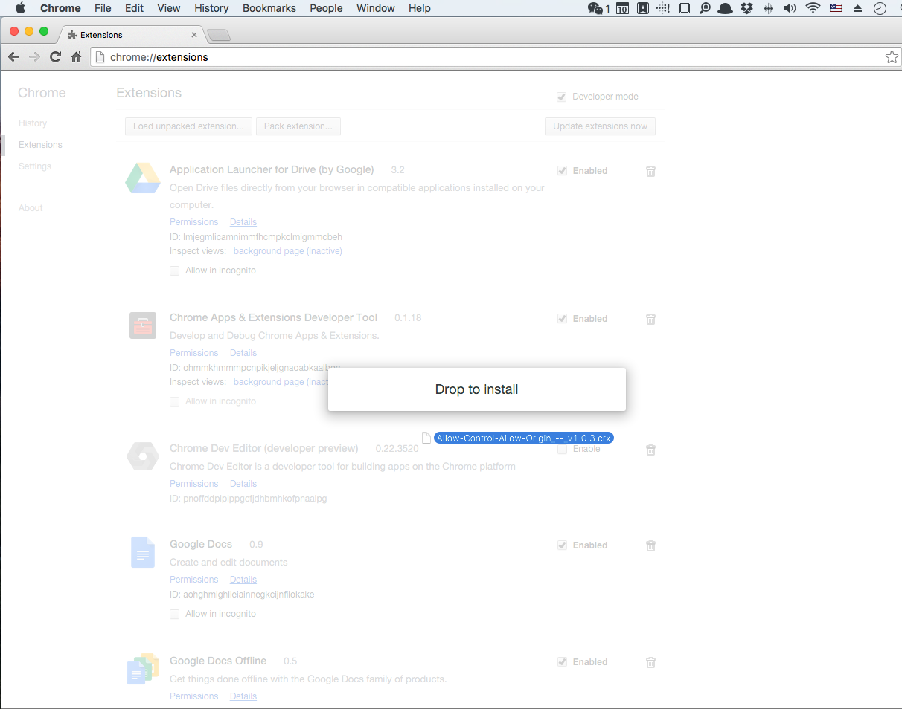

点击确定进行安装即可

## 使用说明
程序的使用大致分成四个阶段

1. 找到 kindle 数据库文件
2. 导入`vocab.db`文件
2. 选择要导出的书籍
3. 确认 有道翻译API 已经成功申请并填写
4. 对该书单词进行翻译或导出
5. 将导出的单词导入 Quizlet

#### 找到 kindle 数据库文件
kindle 的数据库文件`vocab.db`包含有所有单词，它的位置在

Mac: `/Volumes/Kindle/system/vocabulary/vocab.db`
Windows: `待补充`

由于`vocab.db`这个文件是隐藏文件，需要把文件夹显示隐藏文件的功能打开。具体方法可以参考文章：
[苹果Mac操作系统下怎么显示隐藏文件](http://jingyan.baidu.com/album/86fae346947c453c48121a66.html)

用数据线连接 kindle, Mac 下可以用文件搜索找到文件

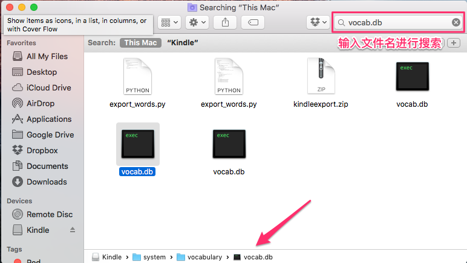

可以把它复制到方便查找的位置

#### 导入`vocab.db`文件

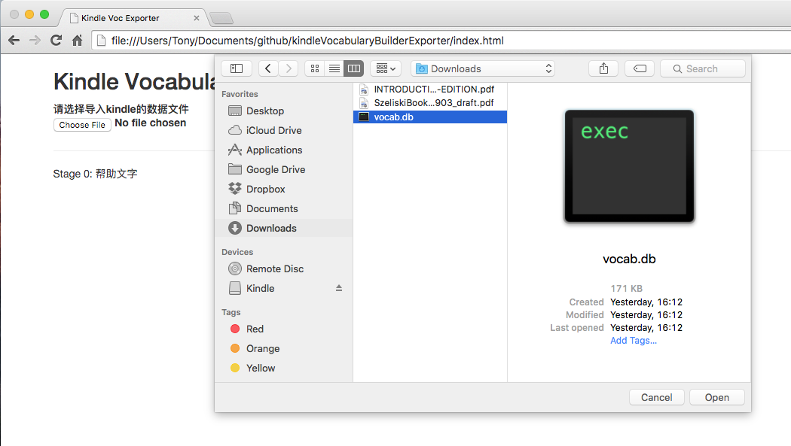

#### 选择要导出的书籍

从下拉菜单选择

#### 确认 有道翻译API 已经成功申请并填写

如果之前已经成功配置好 有道翻译API，那么这里应该显示刚刚填写的 key 和 keyfrom

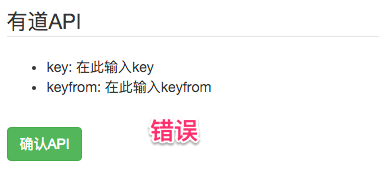

请核对是否填写正确，正确后点击 确认API

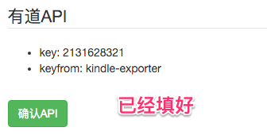

#### 对该书单词进行翻译或导出

- 点击进行翻译后，程序会调用 有道翻译API 对下方列出的所有单词进行翻译
- 点击导出数据后，程序会把下方单词的数据导出成文本显示在导出结果的文本框里面

点击进行翻译
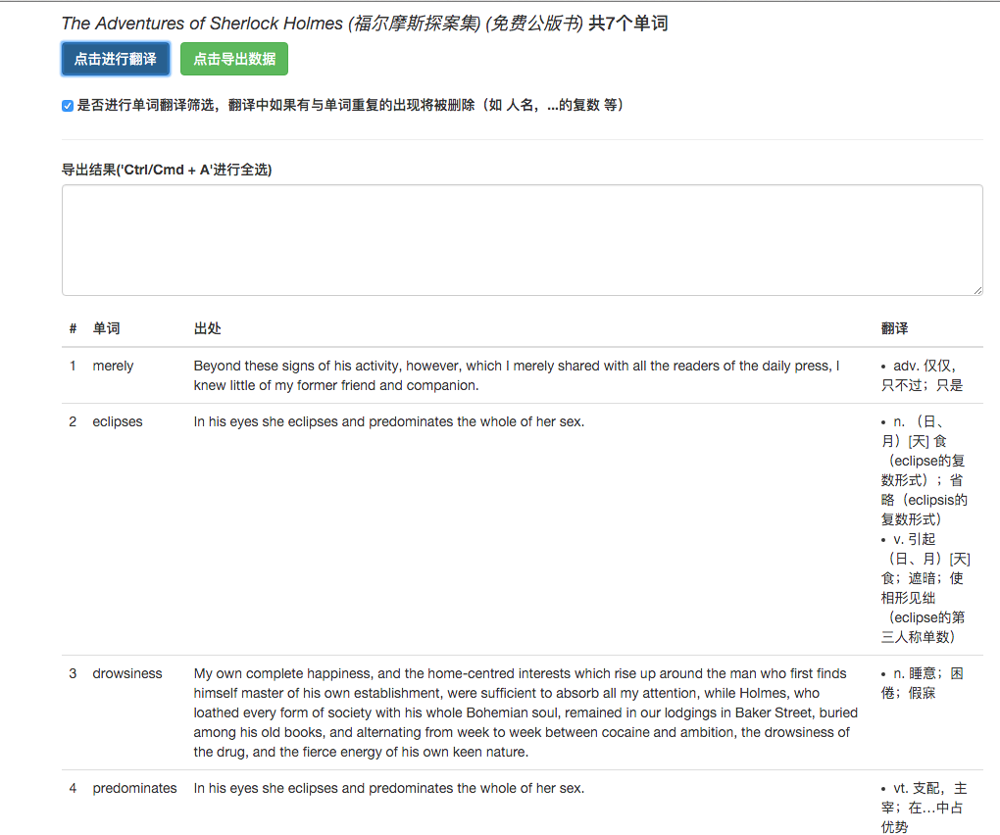

点击导出数据
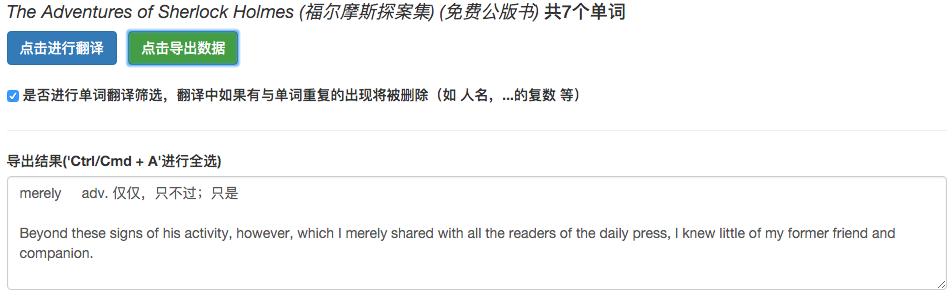

#### 将导出的单词导入 Quizlet

Quizlet 是一个免费的方便学习新单词以及复习单词的网站，用户可以自己导入自己的单词表。

登陆网址 [Quizlet](https://quizlet.com/latest)，注册成为用户

点击`Create a Study Set`创建新的单词表
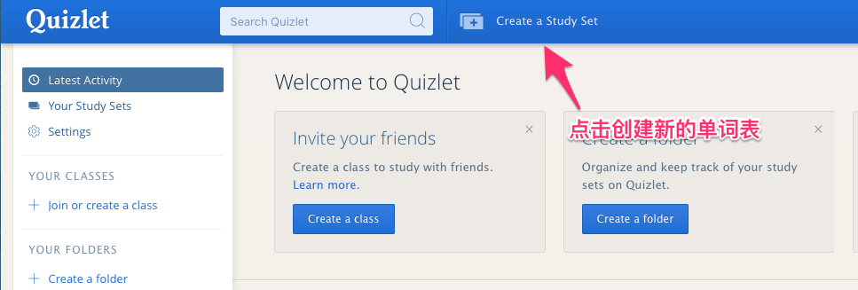

点击`import`导入数据
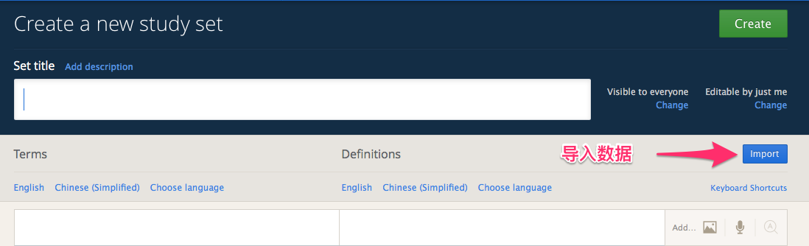

把刚刚的导出结果全选复制到 Quizlet 里面，并在 `Between Rows` 里面输入 `\n\n\n`
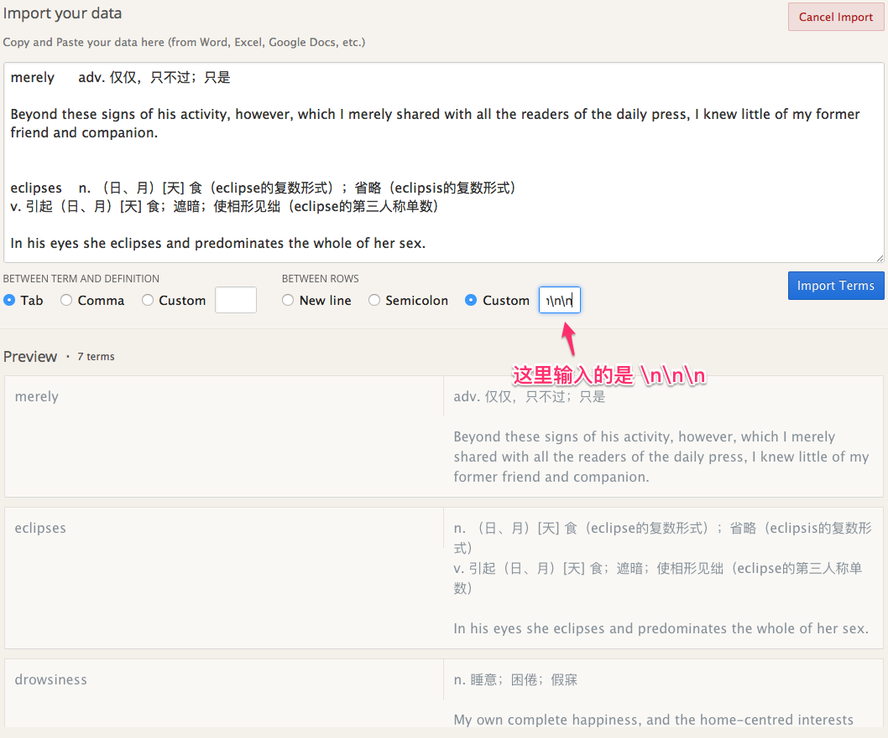

点击 `Import Terms`，至此，大功告成

